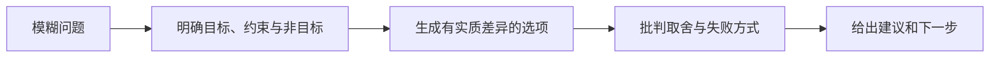

<!-- Chinese reading companion
source: skills/problem-framing/SKILL.md
source-digest: sha256:510505e060c7e838b5d589904ec63093251e989e7888b21dad37006785ada532
translation-status: current
description: 用于追问、发散、权衡批判和形成建议的问题定义工作流。
-->

# problem-framing

> 用于追问、头脑风暴、权衡批判和形成建议的问题定义工作流。

## 它是做什么的

`problem-framing` 帮助 Agent 澄清模糊请求、生成真正不同的选项、批判各自取舍，
并收敛到一个可执行的下一步。它既可以独立运行，也可以作为 DDev、产品设计、
UI 设计或编码流程中的一个模块。

## 什么时候触发

- 用户希望头脑风暴、探索选项、比较方向，或在动手实现前先想清楚。
- 用户希望细化需求、定义产品问题、探索 UX 或命名方向、比较架构选项，或获得批判意见。
- 由于歧义会改变风险、验收标准或成本，其他工作流需要先进行有针对性的追问。

## 工作方式



## 安装

```bash
npx skills add deweyou/skills --skill problem-framing
```

## Source

This skill is maintained in `deweyou/skills`.
