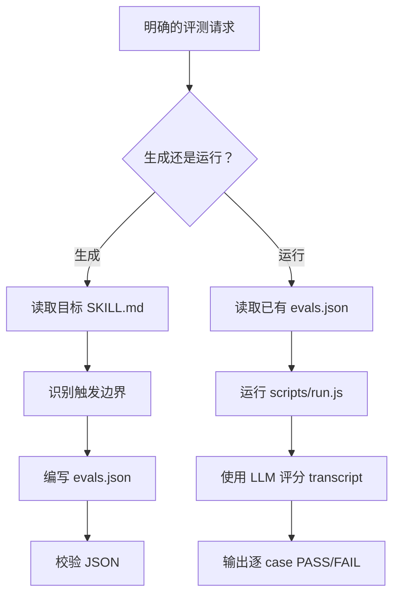

<!-- Chinese reading companion
source: skills/skill-eval/SKILL.md
source-digest: sha256:157afd3694094b9aa2577293c7d2093cd98bfc35d6726c2cdec20463d0769fea
translation-status: current
description: 用于生成 skill eval case、运行 Agent CLI 测试、评分 transcript 和汇总路由准确率的评测工作流。
-->

# skill-eval

> 用于生成 skill eval case、运行 Agent CLI 测试、评分 transcript 和汇总路由准确率的评测工作流。

## 它是做什么的

`skill-eval` 用来确认仓库中的 skills 是否在正确时机触发，并遵守要求的工作流。它既可以根据目标 `SKILL.md` 生成 `skills/<name>/evals/evals.json`，也可以通过 Agent CLI 和 LLM grader 运行已有 eval suite。

运行 eval 会调用 LLM。更新 eval case 是正常的 skill 维护工作，但只有用户明确要求执行评测时才运行 eval runner。



## 安装

```bash
npx skills add deweyou/skills --skill skill-eval
```

## 特点

- 从 skill 的触发边界和工作流约束生成贴近真实用法的 eval case。
- 覆盖 positive prompts、negative prompts、ambiguous prompts 和工作流约束。
- 通过 `scripts/run.js` 调用可配置的 Agent 与 grader 命令模板。
- 检查路由时默认推荐 routing mode，避免真实任务副作用。
- 输出逐 case 的 PASS/FAIL、失败原因和汇总。
- 默认把运行产物保存在临时目录，避免将 transcript 提交到 `<skill>/evals/runs/`。
- 支持 Codex、Claude、自动检测 preset，以及包含 `{PROMPT_FILE}` 的自定义命令模板。

## SOP

1. 确认用户明确要求生成或执行 skill eval。
2. 生成时读取目标 `SKILL.md`，识别触发边界、邻近非触发场景、必须澄清的问题、副作用限制、脚本和输出规则。
3. 将真实 case 写入 `skills/<name>/evals/evals.json`。
4. 校验 JSON 结构。
5. 执行时优先使用已有 eval 文件；缺失时只有在用户同意后才生成。
6. 测试 skill 触发准确率时优先使用 routing mode。
7. 提醒一次执行会调用 LLM 并可能产生费用。
8. 运行 `node skills/skill-eval/scripts/run.js --skill <name> --mode routing`。
9. 报告逐 case PASS/FAIL、失败分类、超时重试，以及运行产物是否保留。

## Source

This skill is maintained in `deweyou/skills`.
