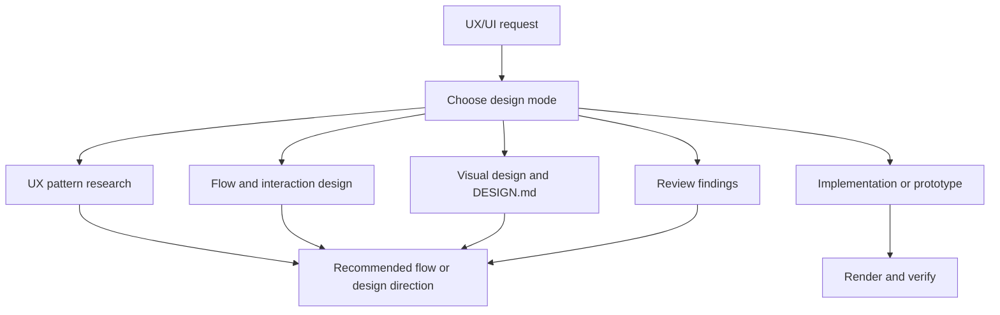

# ui-design

> UX/UI workflow for research, interaction design, visual systems,
> implementation, reviews, and AI design prompts.

## What it does

`ui-design` turns practical UX/UI expectations into an executable workflow. It
covers UX pattern research, flow and interaction design, practical interface
quality, project design contracts such as `DESIGN.md`, production
implementation, reviews, and Sleek or other AI design prompts. The skill
separates general usability and platform quality from visual style, then applies
only the layers needed for the task.
When DDev invokes it for UI requirement design, it produces the smallest useful
prototype artifact before implementation and hands evidence back to DDev.



## When it triggers

- "这个交互别人怎么做", "有没有 UX 参考", "这个流程顺不顺", "审一下体验"
- "帮我设计这个交互", "帮我设计", "优化 UI", "审一下界面"
- "我的风格", "个人设计风格", "专属于我风格"
- Web, dashboard, component-library, landing page, H5, or mobile UI work
- iOS/Android, HarmonyOS, WeChat/Alipay mini program, or macOS interface work
- Sleek prompts or other AI design-generation prompts
- UX/UI review requests that need flow, state, accessibility, visual system, or implementation checks
- DDev UI requirement design that needs a prototype before implementation

## Installation

```bash
npx skills add deweyou/skills --skill ui-design
```

## Features

- Covers web, H5/mobile web, native apps, HarmonyOS, mini programs, macOS,
  dashboards, tools, component libraries, onboarding, settings, empty states, and
  landing pages.
- Chooses among UX research, flow design, visual design, implementation,
  prototype, review, and AI design prompt modes.
- Reads only the relevant references for the task.
- Applies project `DESIGN.md` when visual style, personal taste, component
  fidelity, or design-system persistence matters.
- Requires state coverage for empty, loading, error, success, disabled, selected,
  focus, hover, press, permission, login, and destructive confirmation states
  when relevant.
- Uses rendered or browser verification for significant UI implementation work.

## SOP

1. Classify the request mode and target platform or surface.
2. Identify the user's real workflow and the states it needs.
3. Read the minimal relevant playbook references.
4. Resolve UX structure before visual styling when both are involved.
5. Apply `DESIGN.md` only when the task asks for visual style, system fidelity,
   implementation, or review against a design contract.
6. For implementation, edit the relevant files directly and run the appropriate
   local renderer or browser verification.
7. For reviews, lead with concrete findings ordered by severity and cite files
   when available.
8. Report verification gaps when a surface cannot be rendered or inspected.

## Source

This skill is maintained in `deweyou/skills`.
